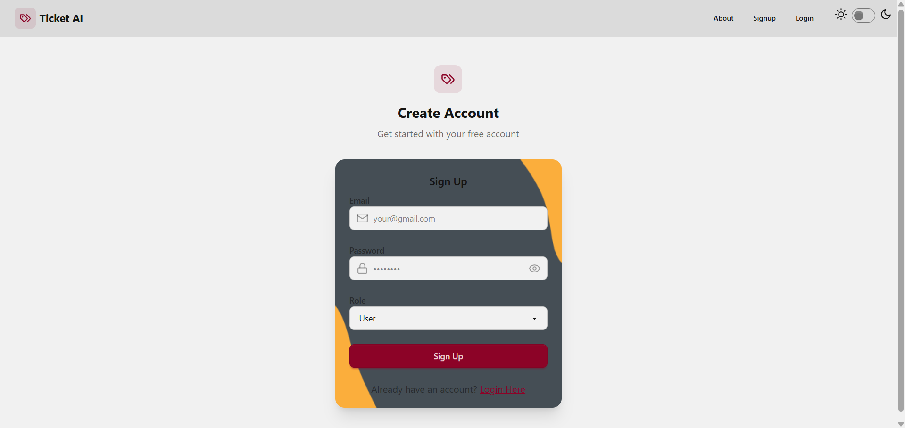

# **AI-Powered Ticket Management System**

Hey everyone! I'm thrilled to share **Ticket AI**, a smart and scalable issue tracking system built using the MERN stack, that uses AI (Gemini) to automatically categorize, prioritize, and assign support tickets to the most appropriate moderators.
This app is designed for users to raise technical queries and for moderators to resolve them efficiently.

## With Ticket AI:

- **User**: Can raise, view, and track ticket status and priority in real-time
- **Moderator**: Can view, assign, and resolve tickets based on skills

🔗 [Live Demo](https://ticket-agent-ai.onrender.com) 

## Features:

### **AI-Powered Ticket Processing** (Via Gemini) 
- Automatic ticket categorization
- Smart priority assignment
- Skill-based moderator matching
- Smart ticket assignment using regex + skill matching
- AI-generated helpful notes for moderators

### **Smart Moderator Assignment**
- Automatic matching of tickets to moderators based on skills
- Fallback to admin assignment if no matching moderator found
- Skill-based routing system

### **User & Role Management**
- Role-based access control (User, Moderator, Admin)
- Skill management for moderators
- User authentication with JWT

### **Background Processing**
- Event-driven architecture using Inngest
- Automated email notifications
- Asynchronous ticket processing
- Email Notifications on ticket updates

## Tech Stack:

**Frontend:** React, TailwindCSS, DaisyUI  
**Backend:** Node.js, Express.js, MongoDB  
**AI Integration:** Gemini API
**Email Service:** Nodemailer with Gmail SMTP   
**Authentication:** JWT (JSON Web Tokens)
**Deployment:** Render 

## **Ticket Processing Flow:**

### Ticket Creation
- User submits a ticket with title and description
- System creates initial ticket record

### AI Processing
- Inngest triggers on-ticket-created event
- AI analyzes ticket content
- Generates: Required skills, Priority level, Helpful notes, Ticket type

### **Moderator Assignment**
- System searches for moderators with matching skills
- Uses regex-based skill matching
- Falls back to admin if no match found
- Updates ticket with assignment

### **Notification**
- Sends email to assigned moderator
- Includes ticket details and AI-generated notes

Made with ❤️ by Anirudha Chaudhary